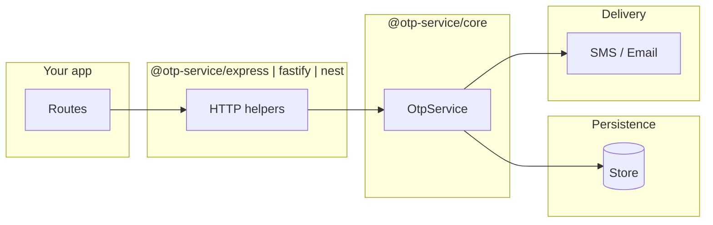
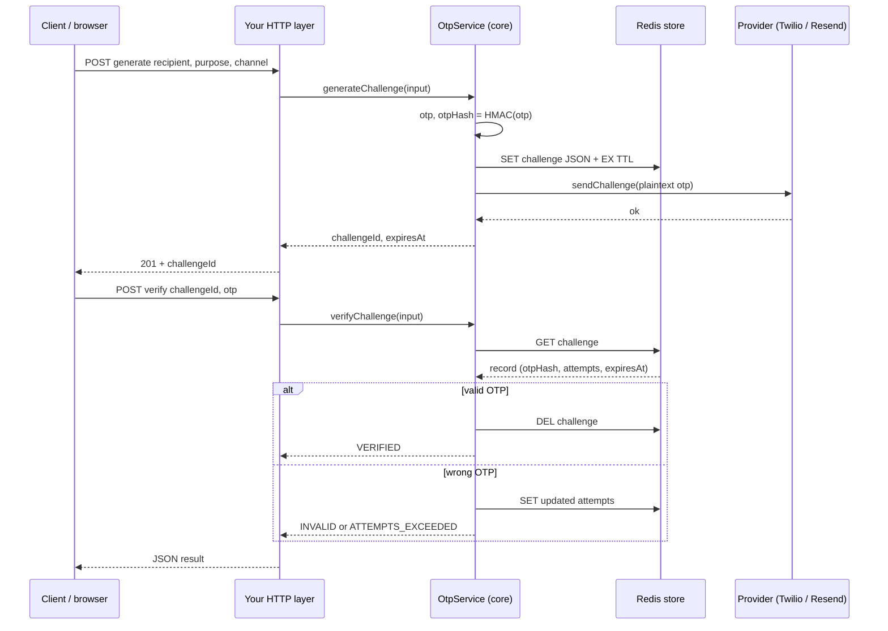

# OTP Infrastructure Package Family

**Production-oriented OTP (one-time password) flows for Node.js services** — generate a challenge, deliver the code over **SMS or email**, verify attempts with TTL and lockout policy, persist state in **Redis** (or your own store). Published on npm under **`@otp-service/*`**, **MIT**, **ESM**, **Node ≥ 22**. The Git workspace root is `private: true`; everything consumers install lives under [`packages/`](packages/) (see [ADR-003](docs/decisions/ADR-003-monorepo-publish-model.md)).

---

## Who this is for

- Teams building **login, signup, or step-up verification** with SMS/email OTP.
- Services that want **library-style** integration (you own routes, env, Redis, providers) — not a hosted SaaS.
- Apps that already use **Express, Fastify, or Nest** and want thin HTTP glue over a shared OTP engine.

---

## Why not one npm package?

You might expect a single install like `npm install otp-service`. This repo deliberately ships **multiple scoped packages** so installs stay small and boundaries stay clear.


| Concern              | One mega-package                                                                   | Split `@otp-service/*` (this repo)                                                                              |
| -------------------- | ---------------------------------------------------------------------------------- | --------------------------------------------------------------------------------------------------------------- |
| **Framework weight** | Either bundle Express + Fastify + Nest for everyone, or juggle many optional peers | Install **only** the framework you use                                                                          |
| **Infrastructure**   | Redis, Twilio, Resend become “everyone’s dependency” or fragile optionals          | **`redis-store`** and **`provider-*`** only if you need them                                                    |
| **Security surface** | Larger dependency tree in every consumer                                           | Minimal tree per app                                                                                            |
| **Maintenance**      | One version number hides adapter-only fixes                                        | Each adapter can be released and documented on its own ([Changesets](https://github.com/changesets/changesets)) |


**Mental model:** you are not installing “the product” as a tarball — you are composing a **small stack** from published building blocks, same idea as `@babel/*`, TanStack, or Radix.

---

## How the pieces work separately — and together

### End-to-end flow (one request)

1. **HTTP** — Your app exposes routes (e.g. `POST /otp/generate`, `POST /otp/verify`).
2. **Framework package** (`@otp-service/express` / `fastify` / `nest`) — Parses JSON bodies, calls into the typed API, maps validation errors to HTTP status codes.
3. **`OtpService` (`@otp-service/core`)** — Single orchestration object: **`generateChallenge`** (create record, hash OTP, call delivery) and **`verifyChallenge`** (load record, check TTL/attempts, compare OTP hash).
4. **Challenge store** — Persists **hashed** state (never plaintext OTP in the DB). Implement yourself or use **`@otp-service/redis-store`** with a Redis client.
5. **Delivery** — Sends the plaintext OTP to the user. Implement yourself or use **`@otp-service/provider-sms-twilio`** / **`provider-email-resend`** with an HTTP client (`fetch` in production).




**Optional shortcut:** **`@otp-service/starter`** wires **core + Redis store + one provider** (Twilio SMS or Resend email) into a ready-made `OtpService` factory so you do not manually call `createOtpService` + `createRedisChallengeStore` + `createTwilioSmsProvider` for the common case.

**Tests and local demos:** **`@otp-service/testkit`** provides in-memory store, recording delivery, and deterministic OTP sequences — not for production traffic.

---

## Complete flow: generate → verify (internals)

Plain-English picture of what happens end to end. The HTTP layer just forwards JSON; **core** owns the rules, **Redis** (if you use it) holds the durable state, and **Twilio / Resend** actually delivers the readable code.

**When someone asks for a code:** your API receives who they are (recipient), how to reach them (channel), and why (purpose). The service creates a fresh challenge id, generates a short code, and turns that code into a **hash** using your signing secret. It **writes** a small record to the store: the hash, expiry time, how many guesses are allowed, plus channel, purpose, and recipient. The **readable code is not stored**—only the hash. It then tells the provider to send the real code by SMS or email. The flow saves first, then sends, so a partial failure after send still leaves something consistent to verify against. If the provider reports a definitive “this will never work” failure, the stored challenge is removed so users are not stuck with a code that never arrived. The API answers with the challenge id and expiry—not the digits.

**When someone submits a code:** your API receives the challenge id and what they typed. The service **reads** the record from the store. If there is no row, or the clock says it is past expiry, you treat it as **expired** (and clear stale rows when applicable). If they are out of guesses, you refuse and drop the record. Otherwise you compare their input to the stored hash in a timing-safe way. A **correct** code succeeds once: you **delete** the challenge immediately so the same code cannot be used again. A **wrong** code consumes one attempt; you update the remaining count, or lock out after the last failure. Independently, Redis-style storage also **expires keys** when the TTL runs out.

### Sequence (system view)



For secrets, hashing choices, and operational hardening, see [docs/guides/security.md](docs/guides/security.md).

---

## Package map


| Package | What it does | When to install |
| ------- | ------------ | --------------- |
| **`@otp-service/core`** | OTP lifecycle: policies, signing/hashing, generate / verify | **Always** (everything else assumes or wraps it) |
| **`@otp-service/express`** | Express handlers for generate/verify | You use **Express** |
| **`@otp-service/fastify`** | Fastify route handlers | You use **Fastify** |
| **`@otp-service/nest`** | Nest-friendly wiring | You use **Nest** |
| **`@otp-service/redis-store`** | Challenge store backed by Redis | You persist challenges in **Redis** |
| **`@otp-service/provider-sms-twilio`** | Twilio SMS delivery | You send OTP via **Twilio** |
| **`@otp-service/provider-email-resend`** | Resend email delivery | You send OTP via **Resend** |
| **`@otp-service/starter`** | Composes core + Redis + Twilio or Resend | **Happy path** — less boilerplate |
| **`@otp-service/testkit`** | In-memory store, fake delivery, deterministic OTP | **Tests** and examples |


---

## Choose your install (use cases)

**A — Fastest path (Redis + Twilio or Resend + Express)**  
`@otp-service/starter` + `@otp-service/express` + `express` + `redis` (and your Twilio/Resend env).  
→ See [starter quickstart](docs/guides/starter-quickstart.md) and [examples/starter-express-sms](examples/starter-express-sms/README.md).

**B — Full control (custom store or custom delivery)**  
`@otp-service/core` + one framework package. You pass your own `ChallengeStore` and `OtpDelivery` into `createOtpService`.  
→ See [direct package setup](docs/guides/direct-package-setup.md).

**C — Redis + off-the-shelf provider, but no starter**  
`@otp-service/core` + `@otp-service/redis-store` + `provider-`* + framework package — assemble with `createOtpService` yourself.

**D — Tests / CI**  
Add `@otp-service/testkit`; keep production packages out of hot paths where possible.

Example dependency lines (adjust versions; published line is **0.x**):

```bash
npm install @otp-service/starter @otp-service/express express redis
# or minimal:
npm install @otp-service/core @otp-service/express express
```

---

## Minimal code sketch (starter + Express)

```ts
import express from "express";
import { createTwilioSmsOtpService } from "@otp-service/starter";
import {
  createGenerateChallengeHandler,
  createVerifyChallengeHandler
} from "@otp-service/express";

const otpService = createTwilioSmsOtpService({
  redis: { client: redisClient, keyPrefix: "otp:login" },
  signerSecret: process.env.OTP_SECRET ?? "",
  twilio: {
    accountSid: process.env.TWILIO_ACCOUNT_SID ?? "",
    authToken: process.env.TWILIO_AUTH_TOKEN ?? "",
    from: process.env.TWILIO_FROM ?? "",
    httpClient: {
      post: (url, input) =>
        fetch(url, {
          body: input.body,
          headers: input.headers,
          method: "POST"
        })
    }
  }
});

const app = express();
app.use(express.json());
app.post("/otp/generate", createGenerateChallengeHandler({ otpService }));
app.post("/otp/verify", createVerifyChallengeHandler({ otpService }));
```

Full runnable shape: [examples/starter-express-sms/README.md](examples/starter-express-sms/README.md).

---

## Contributors — workspace commands

```bash
pnpm install
pnpm build
pnpm test
pnpm test:coverage
pnpm lint
pnpm typecheck
pnpm verify:publishability
```

Package conventions: [docs/conventions/package-template.md](docs/conventions/package-template.md). Agent-oriented layout: [AGENTS.md](AGENTS.md).

---

## Release & npm

Versioning uses [Changesets](https://github.com/changesets/changesets). CI publishes from [`.github/workflows/release.yml`](.github/workflows/release.yml) with **`NPM_TOKEN`**. Setup and token pitfalls (including granular npm tokens): [docs/publishing.md](docs/publishing.md). Pre-release checklist: [docs/release-readiness-checklist.md](docs/release-readiness-checklist.md).

```bash
pnpm changeset
pnpm version-packages
```

---

## Documentation index


| Topic                                     | Link                                                                                                                                        |
| ----------------------------------------- | ------------------------------------------------------------------------------------------------------------------------------------------- |
| Starter (Redis + provider + framework)    | [starter-quickstart.md](docs/guides/starter-quickstart.md)                                                                                  |
| Assemble core + store + delivery yourself | [direct-package-setup.md](docs/guides/direct-package-setup.md)                                                                              |
| Security (secrets, hashing, storage)      | [security.md](docs/guides/security.md)                                                                                                      |
| Express / Fastify / Nest                  | [express.md](docs/guides/frameworks/express.md), [fastify.md](docs/guides/frameworks/fastify.md), [nest.md](docs/guides/frameworks/nest.md) |
| Publishing & npm scope                    | [publishing.md](docs/publishing.md)                                                                                                         |
| Architecture decisions                    | [docs/decisions/](docs/decisions/)                                                                                                          |
| Contributing                              | [CONTRIBUTING.md](CONTRIBUTING.md)                                                                                                          |
| Repo bootstrap / phases                   | [initial-import.md](docs/guides/initial-import.md), [phase-pr-playbook.md](docs/guides/phase-pr-playbook.md)                                |


---

## Contributing

See [CONTRIBUTING.md](CONTRIBUTING.md) (branching, PR hygiene, Changesets, security).